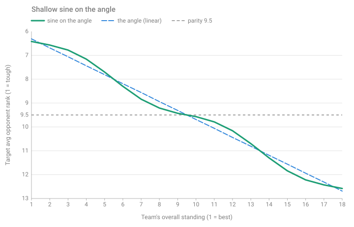
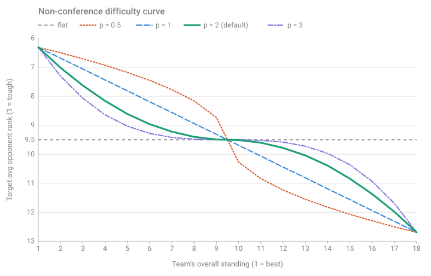
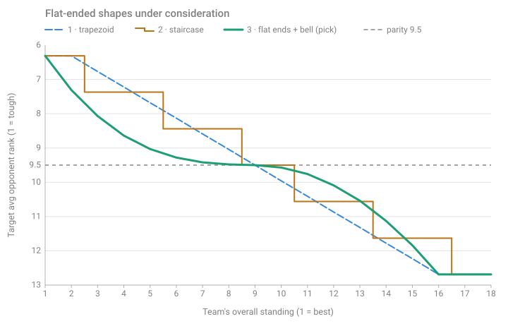

# scheduler — Phase 1: Difficulty Tuning

Addendum to [phase-1-matchups.md](phase-1-matchups.md). How the rank-based generator shapes non-conference strength of schedule on the overall 1–18 ranking — used by Scheduler B and by [Scheduler C](phase-1-matchups-fixed-cpsat.md) (which forces three table-fixed opponents per team in first). **Implemented.** Defaults in `config.py`, overridable in `rules/PNFL.scheduler.toml` `[difficulty]`: spread `A = 3.19`, amplitude `a = 0.30`, period `t = 8`. Targets are soft, never caps — difficulty can't make a schedule infeasible.

## Measure

A team's difficulty = its **average opponent rank**: the overall ranks (1–18) of its non-conference opponents, averaged. 1 = toughest, 18 = easiest, 9.5 = average. The model tracks `opponent_rank_sum`; divide by the team's 4 or 5 non-conference games.

## Spread — `A`

`A` sets the linear trend's ends, symmetric about 9.5:

- #1 team (toughest): `9.5 − A`
- #18 team (easiest): `9.5 + A`

`A = 3.19` → ~6.3 / ~12.7. `A = 0` → everyone 9.5 (parity).

## Curve — sine on the angle

The target is that linear trend plus a shallow sine — a soft staircase: near-flat shelves at the top pair, the middle, and the bottom pair, joined by steeper risers. Closely-ranked teams (whose one-season order is mostly noise) get near-equal slates; the clearly-good and clearly-bad still diverge.

```
target(r) = 9.5 + A * (r - 9.5) / 8.5  -  a * sin(2*pi * (r - 9.5) / period)
```

`r` = overall rank 1–18. `period` (t) sets shelf spacing; `8` centers a shelf on 9.5 and the next on the top/bottom pairs. **`amplitude = 0` gives a straight line** — the plain linear trend, no shelves. Keep `a` below the trend's per-rank slope `A / 8.5` (~0.45 at `A = 3.19`), or the curve stops rising and a worse team could draw a tougher slate.



*`A = 3.19`, `a = 0.30`. Dashed = the linear trend the wave rides.*

## Enforcement

Each team's deviation from target is scored in 1/20-rank units (20 = LCM of 4 and 5, so 4- and 5-game teams share one unit). The solver minimizes the **largest** deviation (minimax), then the total (minisum tie-break). No hard caps, so a schedule always results.

## Sample targets

`A = 3.19`, `a = 0.30`:

| Rank | 1 | 2 | 9 | 10 | 17 | 18 |
|---|---|---|---|---|---|---|
| Target | 6.4 | 6.6 | 9.4 | 9.6 | 12.4 | 12.6 |

Each pair (1–2, 9–10, 17–18) sits close — the shelves. `a` sets shelf flatness; `A` widens the band. Config: `[difficulty]` `spread` = `A`, `amplitude` = `a`, `period` = `t`.

## Test configs

Unit tests run three ranking variants (`5/6/7-free-slots`) across the playoff splits: each conference has 4 playoff teams (2 division winners + 2 wild cards); the 4-team division supplies 1, 2, or 3 of them. This varies how many 5-game teams rank near the top — the case that most stresses the targets. Each league is an overall 1–18 standings.

## Other shapes considered

Not used; kept for reference. Same 1–18 / spread basis.

**Power curve** (the prior implementation) — `p = 1` linear, `p > 1` flatter middle / steeper ends (a bell). Rejected: it splits the near-indistinguishable top and bottom pairs the most.

```
target(r) = 9.5 + A * sign(r - 9.5) * (|r - 9.5| / 8.5) ** p
```



**Flat-ended** — pin the top `k` / bottom `m` teams to equal floor/ceiling targets and vary the middle. Closest to "coarse groups," but need a hard pin and either look blocky (staircase) or also flatten the middle (bell). `floor = 9.5 − A`, `ceiling = 9.5 + A`, `lo = k`, `hi = 19 − m`; `r ≤ lo → floor`, `r ≥ hi → ceiling`.

```
trapezoid:  target(r) = floor + (ceiling - floor) * (r - lo) / (hi - lo)
bell:       mid = (lo + hi) / 2;  half = (hi - lo) / 2;  u = (r - mid) / half
            target(r) = 9.5 + A * sign(u) * |u| ** p
staircase:  tiers = sizes summing to 18;  tier t = 0..T-1 by cumulative size
            target = floor + (ceiling - floor) * t / (T - 1)
```



